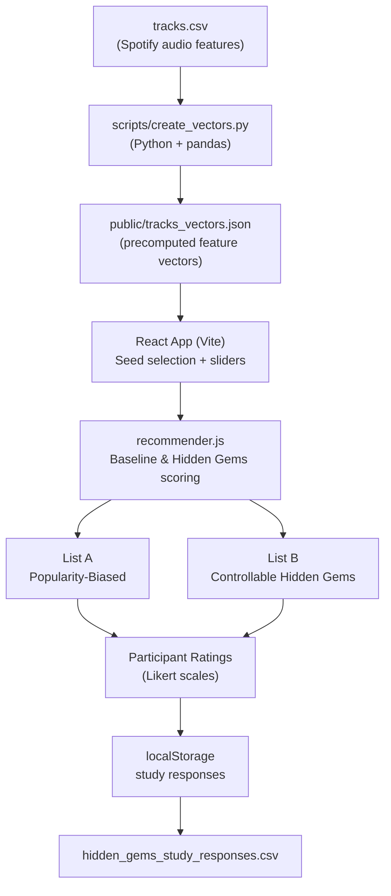

# Hidden Gems Recommender

A browser-based HCI research prototype for CS568 (UIUC) that studies how users perceive **popularity-biased** versus **discovery-oriented** music recommendations using Spotify audio feature data.

---

## Overview

The Hidden Gems Recommender is a user study tool that places two recommendation systems side by side so participants can directly compare them:

- **List A — Popularity Baseline:** Recommends tracks that are acoustically similar to a chosen seed song, with a boost for mainstream popularity.
- **List B — Hidden Gems System:** Recommends tracks based on acoustic similarity *plus* a user-defined control vector (energy, danceability, mood, acousticness, tempo) and a configurable discovery weight that actively favors low-popularity tracks.

After comparing the two lists, participants save their session (seed song, slider settings, and both recommendation lists) to browser `localStorage` and can export all sessions as a CSV file — no server, no login required.

The study is designed to answer: *Does giving users explicit control over audio feature sliders meaningfully change the kinds of tracks a recommender surfaces compared to a popularity-biased baseline?*

---

## System Architecture



---

## Recommendation Algorithms

Both algorithms use **cosine similarity** over 8-dimensional feature vectors.

### List A — Popularity-Biased Baseline

```
score = 0.75 × cosine_similarity(seed, track) + 0.25 × (popularity / 100)
```

Rewards tracks that sound like the seed song *and* are already popular. No user input beyond seed selection.

### List B — Controllable Hidden Gems

```
score = 0.5 × relevance
      + 0.3 × cosine_similarity(control_vector, track)
      + 0.2 × discovery_weight × (1 − popularity / 100)
```

- **`relevance`** — cosine similarity to the seed track.
- **`control_vector`** — an 8-dimensional vector built from the user's slider settings (danceability, energy, mood/valence, acousticness, tempo).
- **`discovery_weight`** — the Discovery slider (0–100) scaled to [0, 1]; higher values push the algorithm harder toward obscure tracks.
- The hidden gem bonus `(1 − popularity / 100)` is maximized for tracks with popularity near zero.

### Feature Vector Dimensions

| Index | Feature | Source |
|-------|---------|--------|
| 0 | `danceability` | Spotify (0–1) |
| 1 | `energy` | Spotify (0–1) |
| 2 | `valence` (mood) | Spotify (0–1) |
| 3 | `acousticness` | Spotify (0–1) |
| 4 | `instrumentalness` | Spotify (0–1) |
| 5 | `speechiness` | Spotify (0–1) |
| 6 | `liveness` | Spotify (0–1) |
| 7 | `tempo_norm` | BPM normalized to [0, 1] via `(bpm − 60) / 160` |

---

## Dataset

The app requires a `tracks_vectors.json` file pre-generated from a Spotify audio features CSV. The expected CSV schema is:

| Column | Description |
|--------|-------------|
| `track_id` | Unique track identifier |
| `track_name` | Song title |
| `artists` | Artist name(s) |
| `album_name` | Album name |
| `track_genre` | Genre label |
| `popularity` | Integer 0–100 |
| `explicit` | Boolean |
| `danceability` | Float 0–1 |
| `energy` | Float 0–1 |
| `valence` | Float 0–1 |
| `acousticness` | Float 0–1 |
| `instrumentalness` | Float 0–1 |
| `speechiness` | Float 0–1 |
| `liveness` | Float 0–1 |
| `tempo` | BPM (float) |

A compatible public dataset is the [Spotify Tracks Dataset on Kaggle](https://www.kaggle.com/datasets/maharshipandya/-spotify-tracks-dataset), which contains ~114,000 tracks across 114 genres. The app deduplicates by `title + artist` and caps the catalog at **15,000 tracks** at load time.

---

## Setup & Running

### Prerequisites

- **Node.js** 18+ and **npm**
- **Python** 3.8+ with **pandas** (`pip install pandas`)

### 1. Generate the Vector File

Place your `tracks.csv` in the `cs568-app/` directory, then run:

```bash
cd cs568-app
python scripts/create_vectors.py
```

This writes `cs568-app/public/tracks_vectors.json`. The script prints the track count on completion.

### 2. Install Dependencies and Start the Dev Server

```bash
cd cs568-app
npm install
npm run dev
```

Open the URL printed by Vite (typically `http://localhost:5173`).

### 3. Build for Production (optional)

```bash
npm run build
npm run preview
```

---

## Using the Study Interface

1. **Filter tracks** — Type a song title, artist name, or genre into the search box. The input uses multi-word AND matching (e.g., `frank ocean acoustic` narrows to tracks where every term appears in the title, artist, or genre). The dropdown updates in real time and shows up to 50 results, ranked by relevance (exact match → starts-with → contains).
2. **Pick a seed track** — Select a track from the filtered dropdown. The seed card below the dropdown confirms your selection and shows its popularity score.
3. **Adjust sliders (List B only)** — Set your preferred levels for Discovery, Energy, Danceability, Mood, Acousticness, and Tempo. List B updates in real time.
4. **Compare the lists** — List A (popularity-biased) and List B (hidden gems) each show 5 recommendations. Each card displays the track, artist, genre, popularity, a Hidden Gem / Moderate / Mainstream label, and a short reason string.
5. **Save your session** — Click **Save study response**. The app records your seed, slider values, and both recommendation lists to `localStorage`.
6. **Repeat** with a new seed to accumulate multiple sessions.
7. **Download CSV** — Click **Download CSV** to export `hidden_gems_study_responses.csv`. Each row includes the seed song, all six slider values, the five baseline songs, the five hidden-gem songs, and the average popularity for each list.

All data is stored locally in `localStorage` under the keys `studyResponses` and `studyResponseCount`. Nothing leaves the browser until you export the CSV.

---

## Tech Stack

| Layer | Technology |
|-------|-----------|
| Frontend framework | React 19 |
| Build tool | Vite 8 |
| Language | JavaScript (JSX) |
| Styling | CSS (Spotify-inspired dark theme: flat black backgrounds, green `#1ed760` accent, custom sliders) |
| Data pipeline | Python 3 + pandas |
| Data storage | Browser localStorage |

---

## Project Structure

```
CS568-FinalProject/
├── README.md
└── cs568-app/
    ├── index.html                  # Vite entry point
    ├── package.json
    ├── public/
    │   └── tracks_vectors.json     # Generated — required at runtime
    ├── scripts/
    │   └── create_vectors.py       # CSV → JSON data pipeline
    └── src/
        ├── main.jsx                # React root mount
        ├── App.jsx                 # Full study UI and state management
        ├── App.css                 # Dark-theme stylesheet
        ├── data/
        │   └── songs.js            # Static sample data (unused in production)
        └── utils/
            ├── loadVectorTracks.js # Fetches and dedupes tracks_vectors.json
            └── recommender.js      # Cosine similarity + scoring algorithms
```

---

## Course Context

This project was built for **CS568: Human-Computer Interaction** at the **University of Illinois Urbana-Champaign**. The study design investigates whether user-controllable parameters improve perceived recommendation quality and user agency in music discovery systems.
