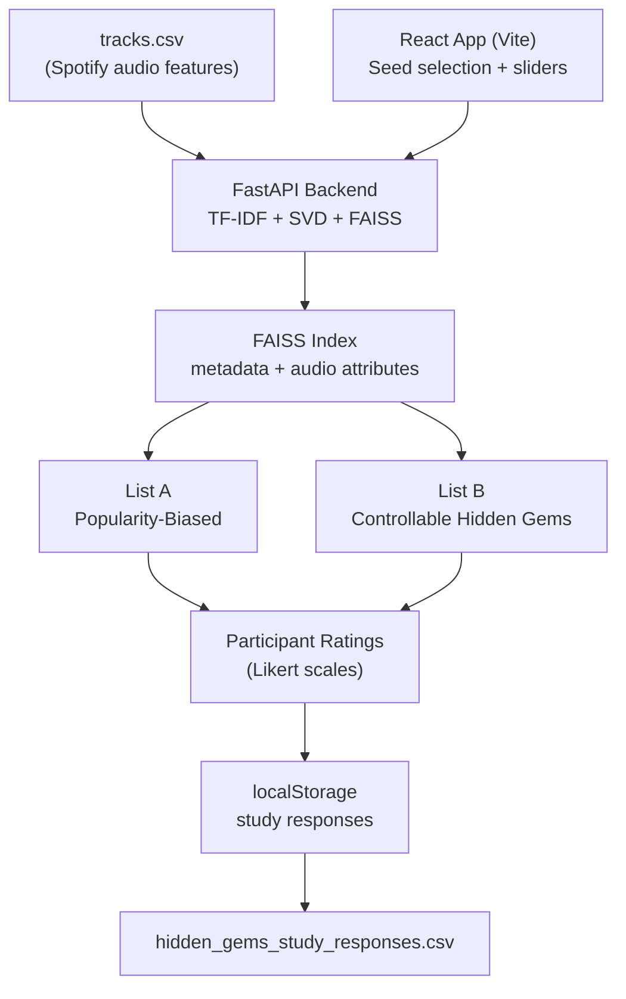

# Hidden Gems Recommender

A browser-based HCI research prototype for CS568 (UIUC) that studies how users perceive **popularity-biased** versus **discovery-oriented** music recommendations using Spotify audio feature data, metadata embeddings, and FAISS vector search.

---

## Overview

The Hidden Gems Recommender is a user study tool that places two recommendation systems side by side so participants can directly compare them:

- **List A — Popularity Baseline:** Recommends tracks whose backend embedding is similar to the chosen seed song, with a boost for mainstream popularity.
- **List B — Hidden Gems System:** Recommends tracks using a backend preference embedding derived from the seed song, slider settings, metadata, and audio attributes, with a discovery target that favors lower-popularity tracks.

After comparing the two lists, participants rate how well each list fits their taste, save their session (seed song, slider settings, ratings, notes, and both recommendation lists) to browser `localStorage`, and export all sessions as a CSV file. The React frontend calls a local Python backend for embedding and FAISS nearest-neighbor search.

The study is designed to answer: *Does giving users explicit control over audio feature sliders meaningfully change the kinds of tracks a recommender surfaces compared to a popularity-biased baseline?*

---

## System Architecture



---

## Recommendation Algorithms

Both algorithms use **FAISS nearest-neighbor search over normalized embedding vectors** generated in the Python backend. Each song is represented by:

- a metadata/text embedding from TF-IDF features projected into a dense space with TruncatedSVD
- a numeric vector built from Spotify audio attributes and normalized popularity

The backend L2-normalizes each part, combines them with weights, normalizes the final vector, then stores it in a FAISS `IndexFlatIP` index. Because vectors are normalized, inner product search behaves like cosine similarity.

### List A — Popularity-Biased Baseline

```
score = 0.82 × faiss_similarity(seed_embedding, track_embedding)
      + 0.18 × (popularity / 100)
```

Rewards tracks that are semantically close to the seed song representation *and* are already popular. No user input beyond seed selection.

### List B — Controllable Hidden Gems

```
score = 0.72 × faiss_similarity(preference_embedding, track_embedding)
      + 0.28 × discovery_popularity_match
```

- **`relevance`** — FAISS similarity between the query embedding and candidate track embedding.
- **`preference_embedding`** — combined vector built from a natural-language preference prompt and numeric slider values.
- **`discovery_popularity_match`** — closeness to a target popularity that shifts from 70 toward 20 as the Discovery slider increases.

### Feature Vector Dimensions

| Index | Feature | Source |
|-------|---------|--------|
| 0 | `danceability` | Spotify (0–1) |
| 1 | `energy` | Spotify (0–1) |
| 2 | `valence` (mood) | Spotify (0–1) |
| 3 | `acousticness` | Spotify (0–1) |
| 4 | `instrumentalness` | Spotify (0–1) |
| 5 | `speechiness` | Spotify (0–1) |
| 6 | `liveness` | Spotify (0–1) |
| 7 | `tempo_norm` | BPM normalized to [0, 1] via `(bpm − 60) / 160` |
| 8 | `popularity_norm` | Popularity normalized to [0, 1] |

---

## Dataset

The backend reads `tracks.csv` directly from the `cs568-app/` directory. The expected CSV schema is:

| Column | Description |
|--------|-------------|
| `track_id` | Unique track identifier |
| `track_name` | Song title |
| `artists` | Artist name(s) |
| `album_name` | Album name |
| `track_genre` | Genre label |
| `popularity` | Integer 0–100 |
| `explicit` | Boolean |
| `danceability` | Float 0–1 |
| `energy` | Float 0–1 |
| `valence` | Float 0–1 |
| `acousticness` | Float 0–1 |
| `instrumentalness` | Float 0–1 |
| `speechiness` | Float 0–1 |
| `liveness` | Float 0–1 |
| `tempo` | BPM (float) |

A compatible public dataset is the [Spotify Tracks Dataset on Kaggle](https://www.kaggle.com/datasets/maharshipandya/-spotify-tracks-dataset), which contains ~114,000 tracks across 114 genres. The backend deduplicates by `track_name + artists`, sorts by popularity, and indexes the top **15,000 tracks**.

---

## Setup & Running

### Prerequisites

- **Node.js** 18+ and **npm**
- **Python** 3.10+ recommended

### 1. Install Frontend Dependencies

```bash
cd cs568-app
npm install
```

### 2. Install Backend Dependencies

```bash
cd cs568-app
python3 -m venv .venv
source .venv/bin/activate
pip install -r backend/requirements.txt
```

### 3. Start the Python Backend

```bash
cd cs568-app
source .venv/bin/activate
uvicorn backend.main:app --reload --host 127.0.0.1 --port 8000
```

The first startup reads `tracks.csv`, fits the metadata embedding pipeline, and builds the FAISS index, so it can take a bit.

### 4. Start the Frontend

```bash
cd cs568-app
npm run dev
```

Open the URL printed by Vite, typically `http://localhost:5173`. Vite proxies `/api` calls to `http://127.0.0.1:8000`.

### 5. Build for Production (optional)

```bash
npm run build
npm run preview
```

---

## Using the Study Interface

1. **Filter tracks** — Type a song title, artist name, or genre into the search box. The input uses multi-word AND matching (e.g., `frank ocean acoustic` narrows to tracks where every term appears in the title, artist, or genre). The dropdown updates in real time and shows up to 50 results, ranked by relevance (exact match → starts-with → contains).
2. **Pick a seed track** — Select a track from the filtered dropdown. The seed card below the dropdown confirms your selection and shows its popularity score.
3. **Adjust sliders (List B only)** — Set your preferred levels for Discovery, Energy, Danceability, Mood, Acousticness, and Tempo. List B updates in real time.
4. **Compare the lists** — List A (popularity-biased) and List B (hidden gems) each show 5 recommendations. Each card displays the track, artist, genre, popularity, a Hidden Gem / Moderate / Mainstream label, and a short reason string.
5. **Rate both lists** — Use the 1–5 taste-fit poll for List A and List B, and optionally add a short note for each list.
6. **Save your session** — Click **Save study response**. The app records your seed, slider values, ratings, notes, and both recommendation lists to `localStorage`.
7. **Repeat** with a new seed to accumulate multiple sessions.
8. **Download CSV** — Click **Download CSV** to export `hidden_gems_study_responses.csv`. Each row includes the seed song, all six slider values, the taste-fit ratings, optional notes, the five baseline songs, the five hidden-gem songs, and the average popularity for each list.

Saved study responses are stored locally in `localStorage` under the keys `studyResponses` and `studyResponseCount`. Seed selections and slider settings are sent to the local Python backend to generate recommendations.

---

## Tech Stack

| Layer | Technology |
|-------|-----------|
| Frontend framework | React 19 |
| Build tool | Vite 8 |
| Language | JavaScript (JSX) |
| Styling | CSS (Spotify-inspired dark theme: flat black backgrounds, green `#1ed760` accent, custom sliders) |
| Backend API | FastAPI + Uvicorn |
| Embeddings | scikit-learn TF-IDF + TruncatedSVD over song metadata |
| Vector search | FAISS `IndexFlatIP` |
| Data pipeline | Python 3 + pandas + numpy |
| Data storage | Browser localStorage |

---

## Project Structure

```
CS568-FinalProject/
├── README.md
└── cs568-app/
    ├── index.html                  # Vite entry point
    ├── package.json
    ├── vite.config.js              # Proxies /api to the Python backend
    ├── backend/
    │   ├── main.py                 # FastAPI + metadata embeddings + FAISS recommender
    │   └── requirements.txt
    ├── public/
    │   └── tracks_vectors.json     # Legacy generated data, no longer required by the UI
    ├── scripts/
    │   └── create_vectors.py       # CSV → JSON data pipeline
    └── src/
        ├── main.jsx                # React root mount
        ├── App.jsx                 # Full study UI and state management
        ├── App.css                 # Dark-theme stylesheet
        ├── data/
        │   └── songs.js            # Static sample data (unused in production)
        └── utils/
            └── api.js              # Frontend API client for backend recommendations
```

---

## Course Context

This project was built for **CS568: Human-Computer Interaction** at the **University of Illinois Urbana-Champaign**. The study design investigates whether user-controllable parameters improve perceived recommendation quality and user agency in music discovery systems.
